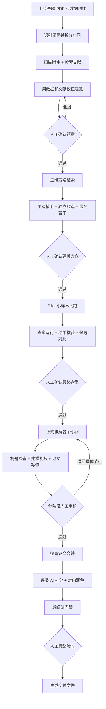

# 我做了一个真正把数学建模流程跑起来的多 Agent 工作台：Remit

<p align="center">
  
</p>

大家好，我最近在做一个开源项目，叫 **Remit**。

项目地址：[github.com/zhou2030109-glitch/Remit](https://github.com/zhou2030109-glitch/Remit)

<p align="center">
  <a href="#先看-remit-长什么样">产品界面</a> ·
  <a href="#它最终想解决的不只是给一个答案">项目思路</a> ·
  <a href="#从上传赛题到拿到论文remit-会经历什么">完整流程</a> ·
  <a href="#它和普通的ai-写数模有什么区别">方案对比</a> ·
  <a href="#技术上remit-是怎么组成的">技术架构</a> ·
  <a href="#快速体验">快速体验</a> ·
  <a href="#加入交流群">交流群</a>
</p>

如果你用大模型参加过数学建模比赛，可能见过这样的场面：题目刚发给 AI，它马上就能
列出一串看起来很专业的模型；继续追问，它也能写代码、画图、生成论文。但真正把这些
东西放进一场比赛里，问题很快就会暴露出来：

- 题意可能从第一步就理解偏了，后面却一直沿着错误方向跑；
- 推荐了很多模型，却没有说明为什么适合这份数据；
- 文献搜了不少，但论文、建模方案和代码彼此对不上；
- 代码看起来完整，实际上没跑，或者结果没有经过验证；
- 中途出错后只能从头再来，之前的分析和产物很难接着用；
- 最后生成了一篇论文，却没人说得清里面的数字到底从哪儿来的。

我做 Remit，就是想认真解决这件事。

它不是一个只负责回答“这道题用什么模型”的聊天机器人，而是一套**本地优先、可以暂停、
可以检查、可以退回修改的数学建模工作流**。从读题、看附件、查文献，到选模型、写代码、
真实运行、验证结果，再到论文写作和最终交付，每一步都有明确的负责人，也会留下可以
回头核对的文件。

一句话概括：

> Remit 让 AI 像一支数模队伍一样分工协作，但关键决定始终由人来做。

## 先看 Remit 长什么样

<p align="center">
  
</p>
<p align="center"><sub>Remit 工作台主页：当前项目、阶段进度、人工确认、运行状态和 Agent 协作链。</sub></p>

这张主页不是单纯用来放几个快捷按钮，它首先是一块项目状态板：

| 区域 | 你可以看到什么 |
| --- | --- |
| 当前项目 | 赛题名称、总体进度、当前所处阶段，以及从检查点继续任务的入口 |
| 待人工确认 | 哪些项目正在等你审核，避免任务悄悄越过关键决定 |
| 阶段进度 | 题目理解、数据处理、模型设计和结果分析分别进行到哪里 |
| 项目概览 | 本地保存了多少项目、最近的任务状态和可继续处理的工作 |
| 运行状态 | 正在执行的任务数量，以及目前停在人工节点的任务 |
| Agent 协作链 | Coordinator、Modeler、Coder、Writer 是否已连接、各自负责什么 |

从左侧可以创建项目、浏览历史任务、继续中断的项目、打开命令面板，并为不同 Agent 配置
模型连接。进入某个项目后，界面会继续拆成题目、数据、文献、模型、代码、结果和论文等
独立视图。这样做是为了让一次数模任务看起来像一个真正的工程项目，而不是一段越滚越长、
最后很难回头检查的聊天记录。

## 它最终想解决的，不只是“给一个答案”

我希望 Remit 做到三件事。

第一，**别把推理过程藏起来**。为什么这样理解题目，为什么选择这个模型，参考了哪些
文献，淘汰了哪些候选，都应该有记录。

第二，**让代码真的跑起来**。模型好不好，不靠语言模型自己评价，而是尽量放到同一份
数据、同一套指标下面真实比较。

第三，**让人随时能接管**。AI 可以做大量执行工作，但题意确认、模型定案和最终交付这类
关键节点，系统会停下来等人审核。发现问题时，可以退回具体步骤，而不是把整项任务推倒
重来。

这也是 Remit 最核心的设计思路：**AI 负责执行，人负责判断；所有重要结论都尽量有证据。**

## 从上传赛题到拿到论文，Remit 会经历什么？

先用一张图看完整流程：



下面我按一次真实任务的顺序，把这套流程完整讲清楚。

## 第一阶段：先把题目读对

用户上传赛题 PDF 和附件以后，Coordinator 会先处理题面。

它会提取题目标题、背景和每个小问，并把小问原文单独保存。这个原文相当于整个任务的
“锚点”：后面的 Agent 可以补充分析、修正理解，但不能悄悄把原题改成另一个问题。

对于每个小问，Coordinator 还会继续整理：

- 这一问真正要求的目标是什么；
- 可以使用哪些输入数据；
- 涉及哪些变量、约束和输出；
- 它和前后小问有什么依赖；
- 最容易踩的坑是什么；
- 最后应该用什么方式验证。

有些赛题不只包含文字，还会把关键信息放在坐标图、流程图、表格截图或扫描页里。
Remit 可以从 PDF 中裁出这些内容，交给多模态模型识别，再把结果作为题面补充，而不是
只读取 PDF 的文本层。识图失败时也不会让整个任务报废，系统会退回到纯文本模式继续。

这一步不会急着推荐模型。先把题目读对，比一上来列十种算法重要得多。

## 第二阶段：看看手里的数据到底长什么样

题目拆完后，数据侦察模块会快速扫描附件。

它关心的不只是“有几个 CSV、几个 Excel”，还会检查字段、数据类型、样本规模、缺失值、
重复记录、异常值和潜在的数据质量风险。对于时间序列、分组样本或重复测量数据，也需要
先识别结构，避免后面把本来相关的样本错误地当成独立样本。

这一步的结果会形成数据画像。后面的文献筛选、方法检索、模型选择和验证方案都会读取它。

换句话说，Remit 不是只根据题目里的几个关键词选模型，它还会先看看这份数据到底支不
支持那个模型。

## 第三阶段：查文献，但不把文献当装饰

Remit 会把赛题按小问拆开，为每一问生成英文检索词，然后通过 OpenAlex 搜索学术文献；
OpenAlex 不可用时，可以使用 Crossref 兜底。

完整的文献链路包括：

```text
拆分小问
  → 生成英文检索词
  → 检索文献
  → 去重和标题摘要初筛
  → 抓取可获得的开放全文
  → 精读少量高相关文献
  → 提取可以落地的方法卡
```

全文抓取会尝试使用 OpenAlex、Unpaywall、arXiv 和 Europe PMC 提供的开放获取入口。
拿不到全文时，系统会明确标记为“仅摘要”，不会假装已经读过原文。

每张方法卡会记录：

- 文献解决了什么问题；
- 采用了什么模型或算法；
- 方法成立需要哪些条件；
- 哪些部分可以迁移到当前赛题；
- 证据位于原文什么位置。

更重要的是，搜到文献不等于最终引用。后面的 Pilot 和正式代码会判断这张方法卡究竟是
被采用、修改后采用，还是被拒绝。只有真正影响了方案并经过代码验证的文献，才会进入
最终引用台账。

这样做，是想让“查文献”从论文最后补参考文献，变成真正参与模型选择的一环。

## 第四阶段：拿证据回来，重新检查我们有没有理解错

第一次读题时，Coordinator 看到的主要是题面；到了这里，系统已经有了真实附件画像和
文献方法卡。

Remit 会把这些新证据拿回来，重新校正每个小问的理解。比如：

- 题面暗示可以做预测，但数据量其实只够做解释性分析；
- 原本准备随机划分训练集，但数据按地区或个体成组，应该做分组验证；
- 某个文献方法很好，但它要求的关键变量在附件里并不存在；
- 后一问依赖前一问的输出，需要提前设计统一的数据接口。

校正后的逐题分析会保存成结构化文件，然后 Remit 会停下来等待第一次人工审核。

你可以批准，也可以直接指出“第三问理解错了”或者“这里漏掉了某个约束”。系统会带着
你的累计意见重新分析，而不是把反馈当成一条看完就丢的聊天消息。

## 第五阶段：从本地方法库里找候选

题意确认后，Remit 会调用项目自带的本地建模方法库。

这个方法库按三级组织：

```text
领域（预测、优化、评价、决策……）
  → 子领域（时间序列、数学规划、多指标评价……）
    → 具体方法（SARIMA、线性规划、TOPSIS……）
```

检索输入不只包含小问原文，还会同时使用校正版分析、用户要求、数据画像和文献摘要。
系统分别计算领域、子领域和具体方法的相关性，再按 `20% / 30% / 50%` 合成总分。

默认情况下，每个小问会得到 6 个候选。每个候选不仅有方法名和分数，还会附带：

- 适用前提；
- 常见失败模式；
- 推荐的验证方式；
- 命中了哪些关键词；
- 领域、子领域和方法层分别得了多少分。

方法检索完全在本地运行，不需要向量数据库，也不会额外调用模型或外部服务。同样的输入
和方法库会得到稳定结果，方便复查。

不过，Top 1 并不等于最终答案。这个排序只是给建模 Agent 扩大候选空间，Agent 可以拒绝
高分方法，但必须说明它为什么不合适。

## 第六阶段：不是一个模型说了算

Remit 的核心 Agent 有四个：

| 角色 | 负责什么 |
| --- | --- |
| Coordinator | 忠实读题、拆分小问、整理结构化任务 |
| Modeler | 设计模型、安排验证、复核运行结果 |
| Coder | 写代码、真实执行、保存数字和图表 |
| Writer | 只使用通过检查的结果撰写论文 |

四个角色可以分别配置不同供应商和不同模型。目前支持 OpenAI Chat、OpenAI Responses、
Anthropic 和 Gemini 兼容接入。你可以把推理能力更强的模型交给 Coordinator 或 Modeler，
把更擅长代码的模型交给 Coder，而不是强迫一个模型包办所有事情。

如果开启可选的模型评审组，还会再加入两个视角：

- **Scout（探索员）**：在看不到主 Modeler 答案的情况下，独立提出候选；
- **Critic（盲审员）**：对匿名后的两套方案做整题级评审，重点检查模型路线、验证设计和
  淘汰标准。

最后由主 Modeler 综合题意、数据、文献、方法库和评审意见，形成正式候选方案。

评审组的作用不是“模型越多越好”，而是尽量减少单个模型过早锁定路线的问题。它们仍然
不能绕过后面的真实运行、质量门禁和人工审核。

## 第七阶段：正式求解以前，先做一轮 Pilot

这是我很看重的一步。

很多 AI 建模流程的问题是：模型只在文字里比较候选，最后选中的方案并没有真正和基线
跑过一遍。Remit 会先为每个小问设计一轮小样本 Pilot。

每问安排 2～3 个候选，而且必须有一个简单、可解释的 baseline。所有候选使用相同的数据
划分、相同的评价指标和明确的时间预算。Coder 要真实运行，跑失败的候选也必须如实记录，
不能编造结果。

程序随后会检查：

- 候选是不是来自本轮计划，避免误用旧结果；
- 至少有没有一个候选真实跑通；
- 指标是不是有效数值；
- 对比是否使用了统一口径；
- 运行时间和失败原因有没有记录。

最后，系统会生成一张 Pilot 审批表，把每个候选的指标、数值、耗时、运行状态和最终入选
情况放在一起。Modeler 只能从真实跑通的候选里定案，人也可以在这里再次审核。

先用较小成本淘汰不合适的方案，再把资源投入正式求解，这比直接押宝稳妥得多。

## 第八阶段：正式写代码，也要让结果和论文对得上

模型定案后，Remit 会逐个小问进入正式求解：

1. Coder 编写代码并真实运行；
2. 系统保存代码、文本输出、数值结果和图表；
3. 机器质量门检查产物、指标、稳健性和验证要求；
4. Modeler 根据运行证据复核方案；
5. 如果模型需要调整，Coder 按返修计划重新运行；
6. Writer 使用已经通过检查的结果撰写论文段落；
7. 工作流停下来等待人工审核。

代码执行默认优先使用本机 MATLAB；MATLAB 不可用时，可以回退到本地 Python，也可以
选择 E2B 远程沙箱。每个任务使用独立工作目录，生成的脚本、图片、CSV、质量报告和论文
段落都会保留下来。

Writer 不能随便在文字里创造数字。论文段落需要和真实运行结果、图片以及质量报告对应。
如果某一问失败，系统会尽量保留已有产物，挂起到人工节点，或者只退回这一问重新处理，
不让前面所有工作一起消失。

## 第九阶段：论文不是“拼起来就算完成”

各个小问完成后，Writer 还会撰写摘要、问题重述、问题分析、模型假设、符号说明、敏感性
分析和模型评价等结构章节，再把它们合并成完整论文。

合并以后，评委 AI 会从五个维度通读打分：

- 摘要质量；
- 建模合理性；
- 求解与验证；
- 写作规范；
- 创新性。

评委会指出最薄弱的章节，并给出具体修改要求。Writer 可以定向重写其中最需要改进的
部分，但有一条硬约束：真实计算得到的数字、图片和结论不能被悄悄改掉。

最后，Remit 会执行整篇论文的硬门禁，检查章节是否齐全、字数是否达到要求、有没有残留
占位符、图片引用是否有效、交付文件能否正确生成。

通过以后，系统不会擅自宣布任务结束，而是停在最后一次人工验收。你确认没有问题，才会
生成最终文档。

## 人工审核不是一个装饰按钮

Remit 的 Human-in-the-Loop 不是只在最后问一句“是否满意”。审批节点会展示当前阶段发生
了什么、有哪些关键数字、证据还缺什么、下一步准备做什么，以及批准或退回会产生什么
影响。

你可以：

- 直接批准，让工作流继续；
- 带着具体意见退回当前节点；
- 选择需要返修的小问或论文章节；
- 在任务中断后从检查点恢复；
- 查看历次审批和返修记录。

所以 Remit 更像一间可以检查进度的数模工作室，而不是一个发出问题以后只能等最终答案
的黑盒。

## 最终交付是同源的 PDF 与 LaTeX

每个任务都会有自己的项目目录。根据实际流程，里面会留下：

- 原始题面和结构化逐题分析；
- 数据画像与质量风险；
- 文献搜索结果、方法卡和引用去留记录；
- 本地方法库推荐及分项得分；
- 主建模方案、独立候选和盲审意见；
- Pilot 计划、真实结果和候选对比表；
- Python 或 MATLAB 代码；
- 运行输出、CSV、图表和质量报告；
- 各章节论文内容；
- 可编译的 `res.tex` 与由它连续两次 XeLaTeX 编译得到的 `res.pdf`；
- 终稿证据表达审计、编译记录与 PDF 渲染检查报告；
- 工作流检查点、人工审批和返修历史。

这些产物都归属于当前任务，不会和其他任务共享可变状态。哪怕流程中断，也可以根据检查点
知道已经做到了哪里、下一步该从哪里继续。

## 它和普通的“AI 写数模”有什么区别？

如果只看一句话，区别大概在这里：

| 常见做法 | Remit 的处理方式 |
| --- | --- |
| 根据题目关键词直接推荐模型 | 先读题、扫附件、查文献，再用校正版分析检索方法 |
| 一个模型同时分析、写代码、写论文 | Coordinator、Modeler、Coder、Writer 分工，可分别配置模型 |
| 只在文字里比较方案 | Pilot 使用统一数据和指标真实运行候选 |
| 文献主要用于最后补引用 | 先提取方法卡，再由代码验证是否真正采用 |
| 代码输出和论文数字容易脱节 | 论文写作读取运行产物并经过结果接地检查 |
| 失败以后整段重新生成 | 保存检查点和阶段产物，可退回具体节点返修 |
| 人只能在最后看成品 | 题意、选型、试跑、求解和终稿都有人工审核入口 |
| 最终只得到一段回答 | 保留代码、图表、报告、论文和完整审计链 |

## 技术上，Remit 是怎么组成的？

```text
Vue 3 + TypeScript 前端
          ↓
FastAPI 工作流与 Agent 编排
          ↓
Redis 状态、消息与取消信号
          ↓
本地 MATLAB / Python，或可选 E2B 沙箱
          ↓
任务独立目录与可恢复检查点
```

- **前端**是一套项目工作台，不只是聊天窗口。题目、数据、文献、模型、代码、结果和论文
  都有各自的视图；
- **后端**负责模型调用、任务编排、文件管理、质量门和断点恢复；
- **Redis**负责状态通道、实时消息和取消信号；
- **执行器**负责真正运行 MATLAB 或 Python 代码；
- **任务目录**保存所有中间产物和最终文件。

项目可以在 Windows 上通过源码启动器运行，也支持 Docker Compose。模型密钥只保存在
本地环境文件中，不应该提交到仓库。

## 谁可能会用得上？

我觉得 Remit 比较适合下面几类人：

- 想把 AI 引入数学建模比赛，但不想只依赖一次对话的同学；
- 希望保留代码、证据和人工决策记录的数模团队；
- 对多 Agent、Human-in-the-Loop、可恢复工作流感兴趣的开发者；
- 想研究“语言模型怎样和真实计算工具协作”的朋友；
- 愿意一起完善方法库、质量门和论文交付流程的开源贡献者。

## 当前版本的边界

Remit 目前还是 `0.1.x`，远没有到“装上就能替你拿奖”的程度。

需要提前说明的是：

- 完整工作流需要配置可用的大模型接口，也会产生相应调用费用；
- 文献全文受开放获取状态和网络环境影响，拿不到时会降级为摘要；
- 模型生成的代码会在执行环境中运行，只应在可信的本机或隔离沙箱中使用；
- 最终交付需要系统 PATH 中存在 XeLaTeX（MiKTeX 或 TeX Live）；缺少编译器或
  `res.tex` 编译失败时，任务不会用其他来源的 PDF 冒充成功；
- 项目当前面向可信的单用户本地环境，不适合直接作为公网多租户服务部署；
- AI 的题意理解、模型设计和写作仍然可能出错，人工审核不是可有可无；
- 当前接口和工作流还可能继续调整。

我宁愿把这些限制讲清楚，也不想把项目包装成“一键完成数学建模”。Remit 真正想做的，
是把 AI 参与数学建模的过程变得更完整、更可检查，也更容易由人接手。

## 快速体验

Windows 源码模式：

```powershell
git clone https://github.com/zhou2030109-glitch/Remit.git
cd Remit

Copy-Item backend/.env.example backend/.env.dev

cd backend
uv sync --frozen

cd ../frontend
pnpm install --frozen-lockfile

cd ..
./win_start.bat
```

启动后访问 <http://127.0.0.1:15173>。仓库里附带了一份项目自写的社区降温合成数据，
可以用来走通流程，不需要上传第三方比赛题目。

Docker 用户也可以直接运行：

```bash
cp backend/.env.example backend/.env.dev
docker compose up --build
```

更完整的安装要求、模型配置和安全说明，请查看项目
[README](https://github.com/zhou2030109-glitch/Remit#readme)。

## 最后

我希望 Remit 最后能成为这样一个工具：你把一道赛题交进来，不是等 AI 神秘地吐出一个答案，
而是能看到一支 Agent 小队怎样读题、找证据、试模型、跑代码、检查结果、写论文；你也可以
在任何关键节点停下来，指出问题，然后让流程带着你的判断继续往前走。

项目已经开源，采用 MIT License：

**GitHub：** [zhou2030109-glitch/Remit](https://github.com/zhou2030109-glitch/Remit)

如果这个方向对你有用，欢迎 Star、提 Issue、分享使用体验，或者直接参与开发。尤其欢迎
大家来讨论：一套真正可靠的 AI 数学建模工作流，还缺哪些环节？

## 加入交流群

如果你想继续交流 Remit 的使用、数学建模工作流，或者想一起参与项目开发，可以扫码加入
微信群 **Remit（数模 agent）**。无论是功能建议、运行中遇到的问题，还是对整个工作流的
想法，都欢迎进群讨论。

<p align="center">
  <a href="../assets/remit-wechat-group.png">
    
  </a>
</p>

> 二维码更新于 2026 年 9 月 7 日，当前图片标注为 9 月 14 日前有效。点击图片可查看原图；
> 如二维码失效，可提交 Issue 提醒更新。
